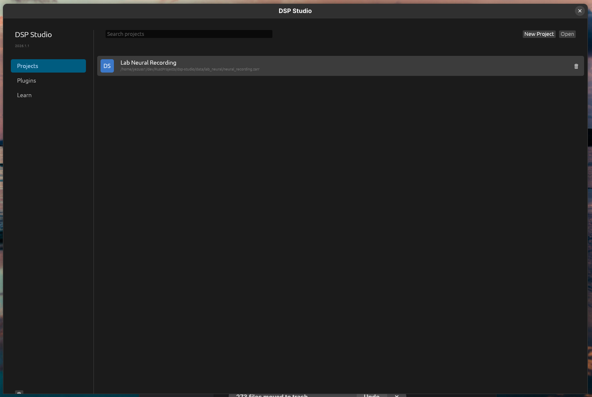
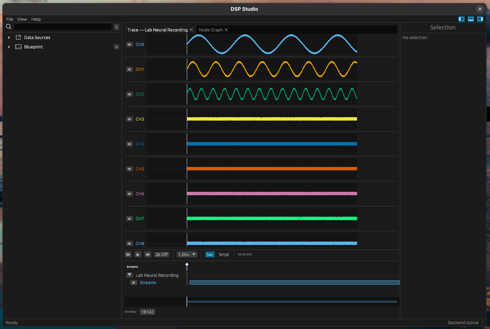
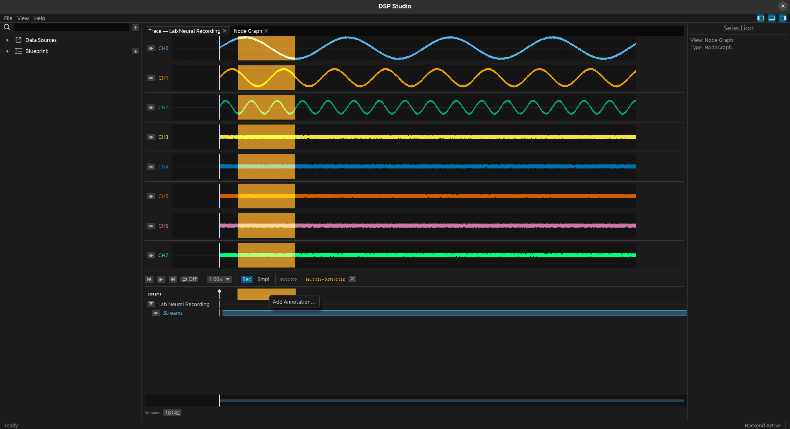
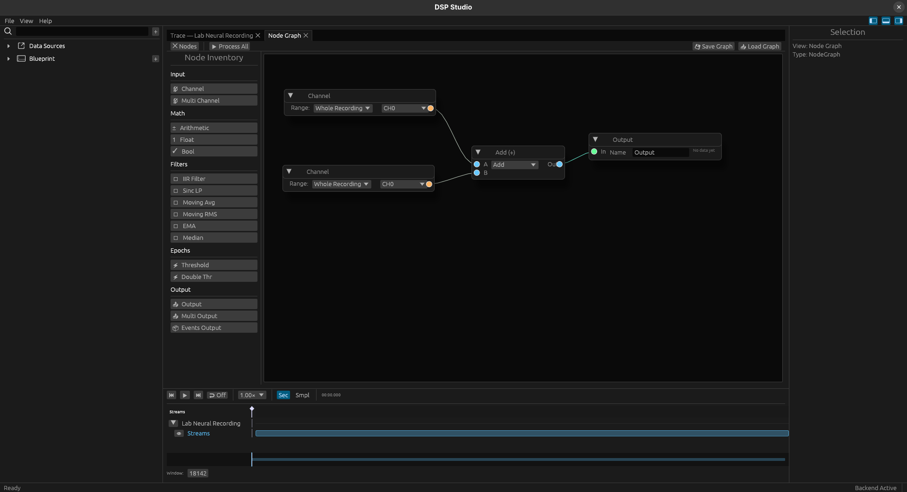
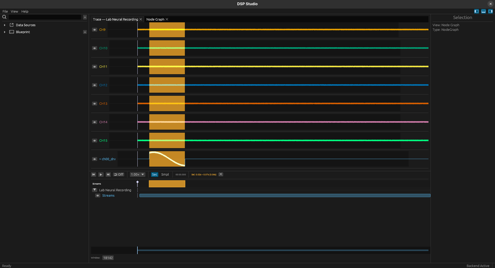
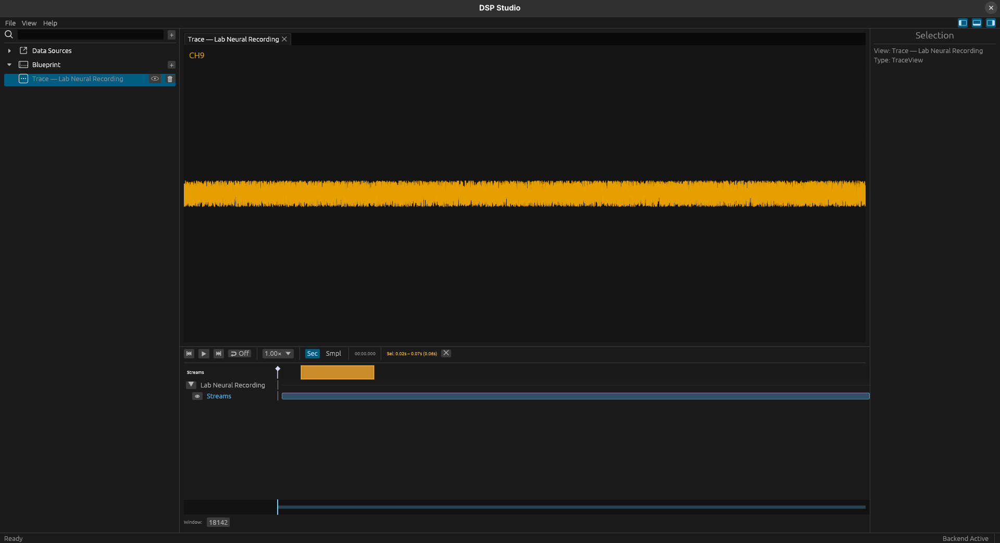

# DSP Studio: High-Performance Neural Data Engine

A professional-grade distributed data plane and DSP workbench designed for massive neural recordings (16+ channels @ 40kHz+). Built with Rust, Zarr v3, and memory-mapped synchronization.

---
This project used Rerun as a blueprint for the UI/UX design. 

## Sample images
### Main View

### Signal Viewer

### Annotations

### Node Graph

### Processing

### Focus View



## 🏗 Modular Architecture

The project is organized into four specialized crates to ensure a clean separation between mathematical logic, data orchestration, and user interaction.

## Architecture & Structure

We follow a clean MVVM structure separating the business/data layer from the shared UI layer.

### UI Component Structure

All UI elements reside in the shared UI layer. For every UI component or screen view, use the
following pattern within its respective features directory:

```
ui/
└── components/
    └── [component_name]/
        ├── [ComponentName].kt             // Stateless & Stateful Compositions
        ├── [ComponentName]State.kt        // UI State Data Class
        ├── [ComponentName]ViewModel.kt    // (Optional) Component-specific logic/state holder
        ├── [ComponentName]Preview.kt      // IDE Compose previews & mock data providers
        └── [ComponentName]Test.kt         // UI and Unit tests
```

---

### 1. `dsp-core` (The Math)

A zero-UI library containing the pure computational kernels.

- **`signal_gen`**: Deterministic ground-truth generators (Sine, WhiteNoise).
- **`resampling`**: Parallelized Min-Max kernels for high-fidelity Peak File generation.
- **`math`**: SIMD-friendly scalar operations for real-time buffer manipulation.

### 2. `dsp-io` (The Data Plane)

The infrastructure layer responsible for storage and transmission.

- **`zarr`**: Zarr v3 implementation for immutable long-term archiving and multi-level LOD (Level of Detail).
- **`mmap`**: High-speed shadow-buffer management for active zero-copy processing.
- **`transmission`**:
  - **UI Service**: Resolution-aware fetching (dynamic LOD selection).
  - **Processing Service**: Surplus-aware windowing with automated zero-padding.
- **`session`**: The Orchestrator that transparently routes channels between Zarr and Mmap.

### 3. `dsp-app` (The UI Layer)

_(In Progress)_ The graphical interface powered by `egui` and `eframe`.

- Real-time visualization of composite views (Raw + Processed).
- High-performance plotting using the pre-computed Min-Max pyramid.

### 4. `dsp-extensions` (The Algorithm Plane)

_(Planned)_ Plugin architecture for advanced neural analysis.

- Digital Filter Banks (FIR/IIR).
- Spike Sorting and Spectral Analysis.

---

## ⚡ Performance Benchmarks

Our **Shadow Bridge** architecture delivers industry-leading latency for massive datasets (1-hour / 9.2GB):

| Benchmark               | Source       | Latency             | Performance                      |
| :---------------------- | :----------- | :------------------ | :------------------------------- |
| **Global View (1h)**    | Zarr (LOD 4) | **~24ms**           | **67% faster** than standard LOD |
| **Real-time View (1s)** | Mmap Shadow  | **~3µs**            | **166x faster** than NVMe I/O    |
| **DSP Throughput**      | Core math    | **53.4M samples/s** | Zero-copy sliding window         |

---

## 🔬 Laboratory & Development

We use a **Laboratory-first** development approach. All features are quantified in the `lab/` directory before integration.

### Running Experiments

```bash
# Data Transmission Bridge
cargo run -p lab --bin lab_01_transmission

# UI Latency & Dynamic LOD Benchmark
cargo run -p lab --bin lab_03_ui_latency

# Mmap Shadow Throughput Benchmark
cargo run -p lab --bin lab_05_mmap_bench
```

### Documentation

```bash
# Generate high-level architecture book
mdbook serve docs

# Generate technical API reference
cargo doc --no-deps --workspace --open
```

---

## 💾 Storage Strategy

All data artifacts are isolated in the root-level `data/` directory to keep source crates "pure."

- `data/archive/`: Zarr v3 hierarchies (Immutable).
- `data/tmp/`: Mmap session buffers (Shadow).
